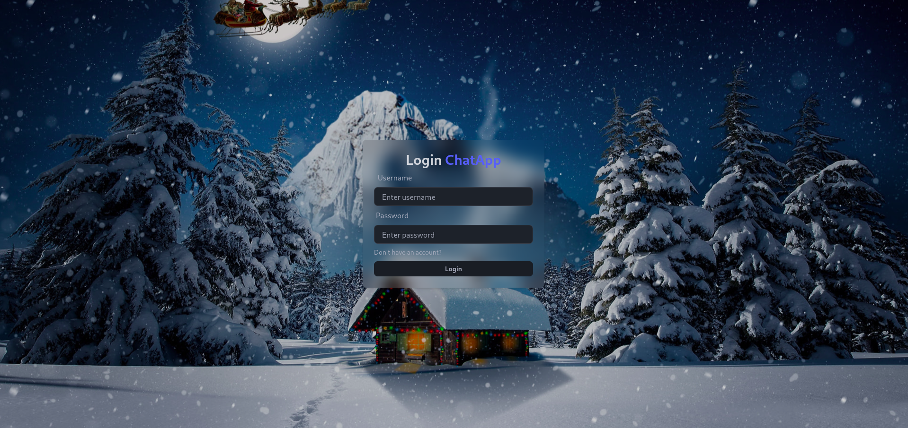

# ChatApp


ChatApp is a real-time chat web application built using the MERN stack (MongoDB, Express, React, Node.js) and Socket.io. It supports user authentication, real-time messaging, online user status, and more, making it an ideal platform for communication and collaboration.

## Table of Contents

- [ChatApp](#chatapp)
  - [Table of Contents](#table-of-contents)
  - [🌟 Features](#-features)
  - [🚀 Tech Stack](#-tech-stack)
  - [🛠 Installation and Setup](#-installation-and-setup)
  - [🎨 Styling](#-styling)
  - [📦 Dependencies](#-dependencies)
    - [Backend](#backend)
    - [Frontend](#frontend)
  - [📷 Screenshots](#-screenshots)
  - [📂 Project Structure](#-project-structure)
  - [🤝 Contributions](#-contributions)
  - [📄 License](#-license)
  - [✨ Acknowledgements](#-acknowledgements)

## 🌟 Features

- **Tech Stack:** MERN + Socket.io + TailwindCSS + Daisy UI
- **Authentication & Authorization:** Secure login and signup with JWT (JSON Web Tokens).
- **Real-time Messaging:** Chat instantly with other users using Socket.io.
- **Online User Status:** Real-time updates for users coming online and going offline (using Socket.io and React Context).
- **Global State Management:** Managed efficiently with Zustand.
- **Error Handling:** Comprehensive error handling on both the client and server sides to enhance the user experience.

## 🚀 Tech Stack

- **Frontend:** React, Tailwind CSS, Daisy UI, Zustand, Socket.io-client
- **Backend:** Node.js, Express, MongoDB, JWT, Socket.io

## 🛠 Installation and Setup

Follow these steps to set up the application locally:

1. **Clone the repository:**

   ```bash
   https://github.com/shayan-tej/chat-app-mern.git
   ```

2. **Install dependencies for both the backend and frontend:**

   - Backend:

     ```bash
     npm install
     ```

   - Frontend:

     ```bash
     cd frontend
     npm install
     ```

3. **Set up environment variables:**

   Create a `.env` file outside the `backend` directory with the following variables:

   ```makefile
   PORT = 5000
   MONGO_DB_URI = your_mongodb_connection_string
   JWT_SECRET = your_jwt_secret
   NODE_ENV = development
   ```

4. **Run the Application:**

   - Backend

     ```bash
     npm run start
     ```

   - Frontend

     ```bash
     cd frontend
     npm run dev
     ```

5. **Access the application:** Open your browser and go to `http://localhost:3000`

## 🎨 Styling

The application is styled using **TailwindCSS** and **Daisy UI** for a modern and responsive user interface.

## 📦 Dependencies

### Backend

- Express
- MongoDB & Mongoose
- Socket.io
- JWT
- bcrypt

### Frontend

- React
- Tailwind CSS & Daisy UI
- Zustand
- Socket.io-client

## 📷 Screenshots

- Sign Up Page
  
- Login Page
  
- Home Page
  
- Chat Page
  

## 📂 Project Structure

```plaintext
ChatApp/
├── backend/
│   ├── controllers/
│   ├── db/
│   ├── middlewares/
│   ├── models/
│   ├── routes/
│   ├── socket/
│   ├── utils/
│   ├── server.js
├── frontend/
│   ├── public/
│   ├── src/
│   │   ├── assets/
│   │   ├── components/
│   │   │   ├── messages/
│   │   │   ├── sidebar/
│   │   │   └── skeletons/
│   │   ├── context/
│   │   ├── hooks/
│   │   ├── pages/
│   │   │   ├── home/
│   │   │   ├── login/
│   │   │   └── signup/
│   │   ├── utils/
│   │   ├── zustand/
│   │   ├── App.jsx
│   │   ├── index.css
│   │   └── main.jsx
│   ├── index.html
│   └── package.json
├── .env
├── .gitignore
├── package.json
└── README.md
```

## 🤝 Contributions

Contributions are welcome! Please feel free to submit a Pull Request or open an issue.

## 📄 License

This project is licensed under the `MIT License`. See the LICENSE file for details.

## ✨ Acknowledgements

- [Socket.io](https://socket.io/)
- [MERN Stack](https://www.mongodb.com/resources/languages/mern-stack)
- [Tailwind CSS](https://tailwindcss.com/)
- [Daisy UI](https://daisyui.com/)
